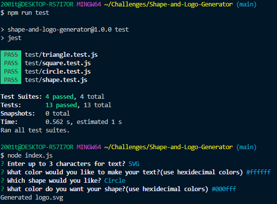

# Shape-and-Logo-Generator

## Description
This application is a Shape/logo generator that when accessed asks for 3 inputs and 1 choice of a list of 3 options: "Enter up to 3 text", "What color would you like to make your text?(use hexidecimal colors)", "What color do you want your shape?(use hexidecimal colors)", and "Which shape would you like?". While creating this application I have learned how to address bugs/errors prior to deployment via tests.
## Usage

## Video
[Google drive link](https://drive.google.com/file/d/1CBZuk4hqZYs9p4Psy-2FqCPg7vdHGeln/view?usp=drive_link)